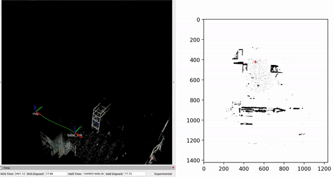
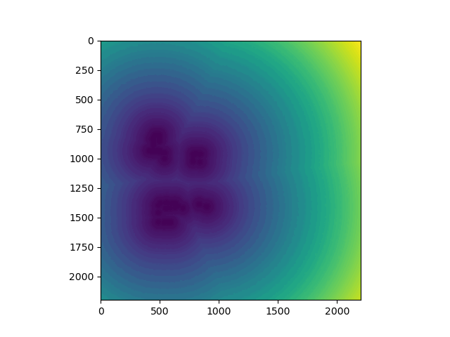

# Mapping Module

Th mapping module has several opesource packages along with some custom code to build real-time occupancy, EDT, and Elevation mapping. 
The data-set to get started is [recorded data](https://drive.google.com/file/d/1wtsTLBo_hk1uh4V_LsyKbIkeyMXptVJp/view?usp=sharing) (5GB). By defult the file should be under home/user/Downloads. IF you have realsense camera then data is not needed.
unzip the file 
```
cd ~/Downloads
unzip ~/Downloads/L515_test.zip
```
## Examples
###  Occupancy grid
<p align='center'>

</p>

### EDT
<p align='center'>

</p>

### Elevation mapping
<p align='center'>

</p>


## 1. Prerequisites
### 1.1 **Ubuntu** and **ROS**
Ubuntu 64-bit 20.04
ROS Noetic. [ROS Installation](http://wiki.ros.org/noetic/Installation/Ubuntu)

### 1.2 **Librealsense**
Follow the instructions in offical page [librealsense](https://github.com/IntelRealSense/librealsense/blob/master/doc/installation.md)

### 1.3. **Ceres Solver**
Follow [Ceres Installation](http://ceres-solver.org/installation.html).

### 1.4. **PCL**
Follow [PCL Installation](http://www.pointclouds.org/downloads/linux.html).

Tested with 1.8.1

### 1.5 **OctoMap**
Follow [OctoMap Installation](http://wiki.ros.org/octomap).
```
sudo apt-get install ros-noetic-octomap*
```

### 1.6. **Trajectory visualization**
For visualization purpose, this package uses hector trajectory sever, you may install the package by 
```
sudo apt-get install ros-noetic-hector-trajectory-server
```
Alternatively, you may remove the hector trajectory server node if trajectory visualization is not needed

### 1.7. **Dynamic configure**
```
apt-get update apt-get install ros-noetic-ddynamic-reconfigure
```
### 1.8. **Grid map**
```
sudo apt-get install ros-noetic-grid-map
```

### 1.9. **Realsense-ROS**
Follow [realsense-ros](https://github.com/IntelRealSense/realsense-ros/tree/ros1-legacy).

## 2. Installation Instructions
### 2.1 Create a new conda environment (optional but preferred)
```
conda create --name <desired_name>
conda activate <desired_name>
```
### 2.2 Create a new workspace at desired location
```
cd ~/catkin_ws
mkdir src && cd src
git clone https://github.com/uiuc-iml/SATYRR.git
```
You may be asked to verify your credentials since it's a private repo.

###  2.3 Build the file
```
cd ..
catkin_make
source ~/catkin_ws/devel/setup.bash
```
IF there is still missing dependencies and buid process is not complete. Just install that dependency!


## 3. Running the module


### 3.1 Launch the complete mapping with given data (Not setup with filter/work in progress)
Ensure the data/camera is configured properly in ROS launch files [catkin_ws/src/SATYRR/mapping/ssl_slam/launch]
```
bash ./src/SATYRR/mapping/map_start
```
You will see the occupancy grid buliding up and also elvation map. Note: Current data playback is at 0.2 speed. Not eaxtly real-time due to high compuation cost in filtering (work in progress)

### 3.2 Launch the complete mapping with realsense (Not setup with filter/work in progress)
```
roslaunch ssl_slam mapping_complete_elev_with_L515.launch
```

### 3.3 Launch the occupancy and EDT mapping with given data 
```
roslaunch ssl_slam ssl_slam_with_rosbag.launch
```
You will see the occupancy grid building up. If wants to visulize the point cloud map in rviz, change line 25 arg in launch file [arg name="rviz" default="false" /> to "true"]

### 3.4 Launch the occupancy and EDT mapping with L515 (Most useful for now in SATYRR)
```
roslaunch ssl_slam ssl_slam_L515.launch
```
### 3.5 Octomapping
```
roslaunch ssl_slam ssl_slam_octo_mapping.launch
```
## 4. Tips (additional instructions)
##### 4.1 IF having issues due to elevation map package remove all the folders in src other than ssl_slam, realsense-ros, python_files_backup. And do build again
##### 4.2 Realsense camera has lot of customization, with ordered/unordered point cloud, resolution, frame rate, filters, etc.. check the official intelrealsense documentation to customize as required
##### 4.3 The custom python files are inside ssl_slam folder. If needs to make any changes change there. The python_files_backup folder can be used to revert the changes back.
##### 4.4 The python files are launched through roslaunch. If launch is not success than change the permission using "chmod +x ./src/SATYRR/mapping/ssl_slam/main_mapping.py". May need to do for other python files also. Refer the following article to understand the process [ROSlaunch python scripts](https://automaticaddison.com/how-to-create-and-execute-ros-launch-files/).
##### 4.5 There is lot parameters definition in the python files. All of them are desribed with the script itself at appropriate lines. Use those parameters to tune the occupancy and elevation maps as required. 
